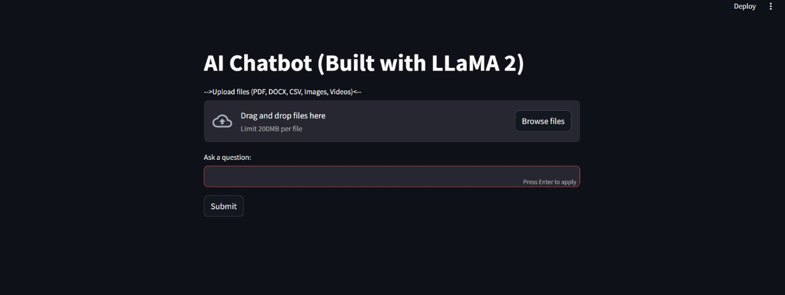
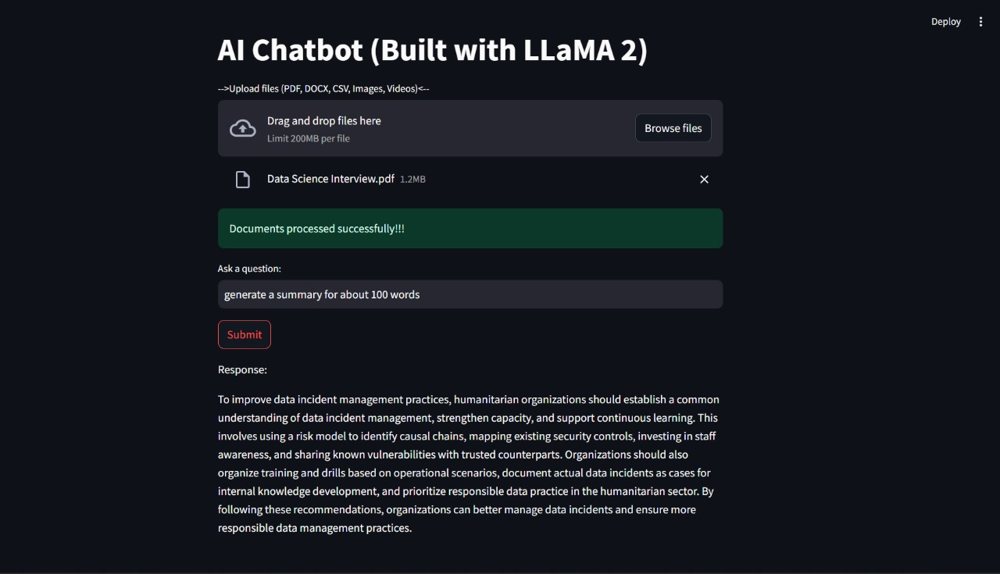
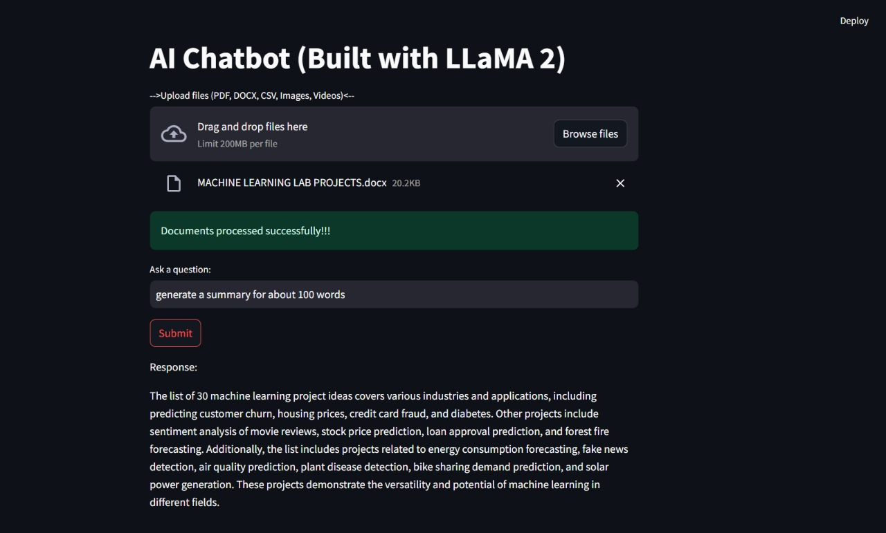
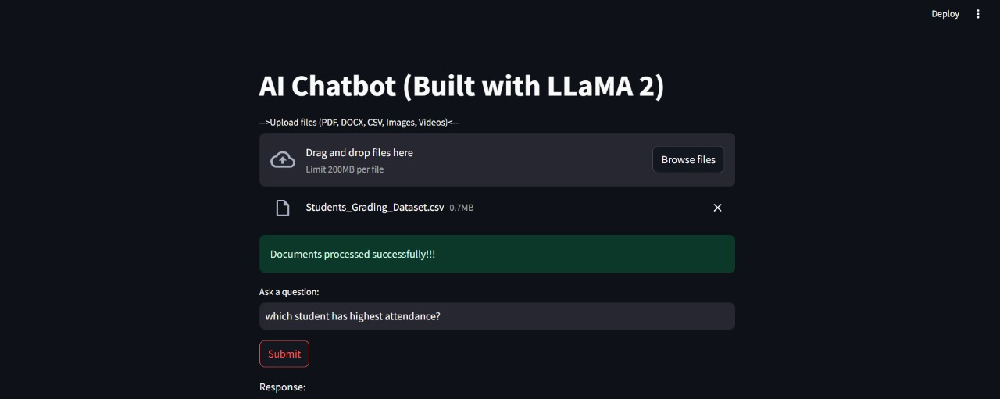
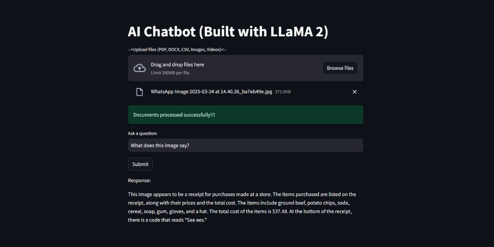
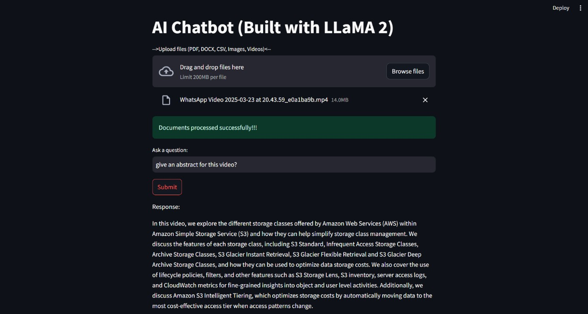

# AI-Chatbot-with-LlaMA2
This is a very simple chatbot that uses LlaMA2 model for reading, analyzing and answering user queries based on the document uploaded. The chatbot supports the following file formats: .docx, .pdf, .csv, videos(mp4, mvi, mov) and images(jpg, jpeg, png).

- sample testing datasets for pdf, csv, word, images and videos have been provided.
- Other sources can also be used.

# Required Packages (requirements.txt)
- faiss-cpu
- numpy
- streamlit
- pdfplumber
- pytesseract
- openai-whisper
- pandas
- torch
- ollama
- ffmpeg-python
- pillow
- transformers
- sentence-transformers
- python-docx
- concurrent.futures
  
NOTE: This can be stored as requirements.txt and run _'pip install requirements.txt'_

# Main source file to run: app.py (run this file after installing all necessary packages)

# PDF UPLOAD

# WORD UPLOAD

# CSV UPLOAD

# IMAGE UPLOAD

# VIDEO UPLOAD

